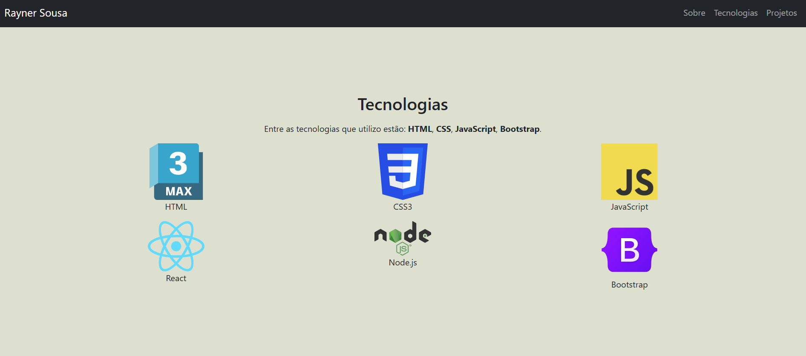
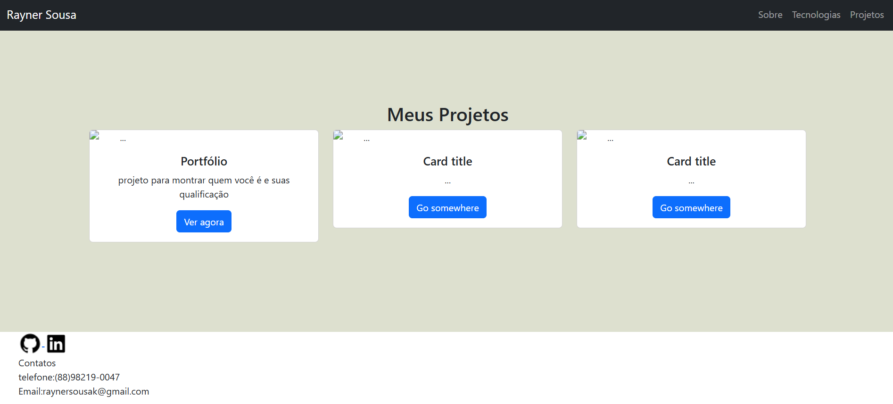

# repositorio portf-lio do rayner:
O site vai monstra um pouco sobre o rayner e sobre suas qualificações e as linguagem e framework que conheçe.

## IMAGENS DO SITE 
.introdução do site

.Tecnologias

.projetos e radaper

## Linguagem/framework usados para construir o site
.HTML5  | .BOOTSTRAP
.CSS    | 